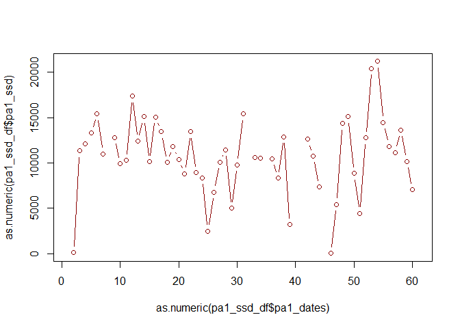
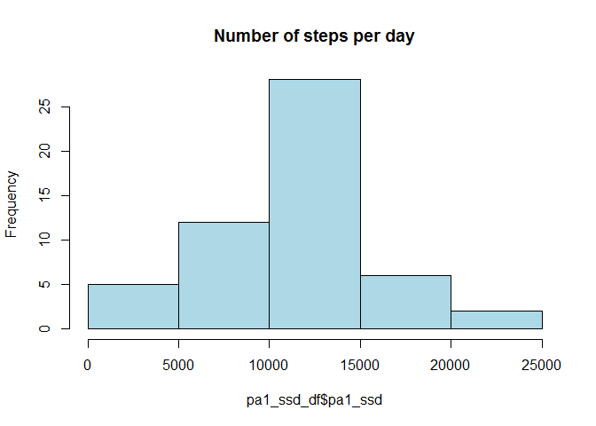
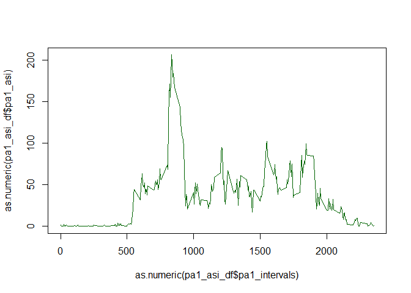
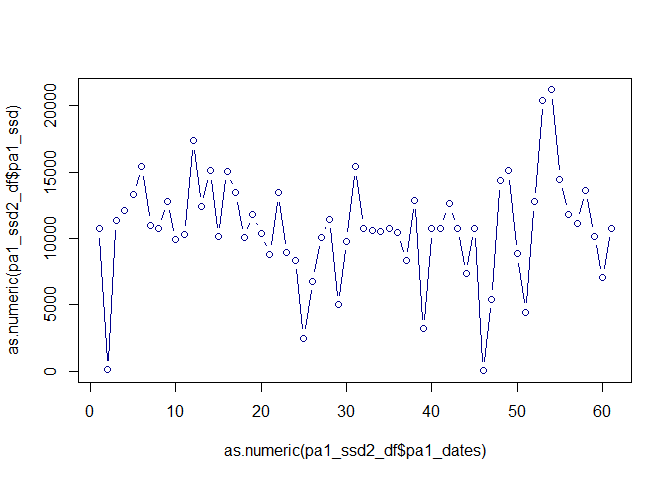
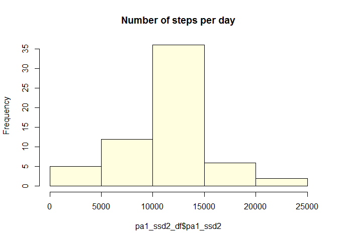
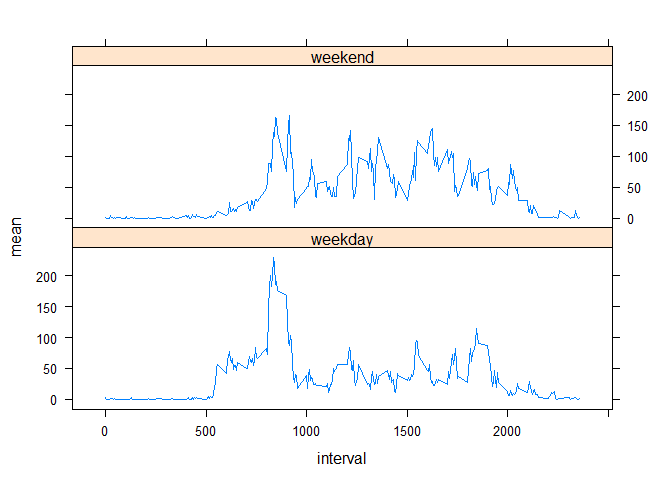

# Reproducible Research: Peer Assessment 1
Marcos Vanine Nader  
July 19, 2015  


## Introduction

This assignment makes use of data from a personal activity monitoring device. This device collects data at 5 minute intervals through out the day. The data consists of two months of data from an anonymous individual collected during the months of October and November, 2012 and include the number of steps taken in 5 minute intervals each day.

The variables included in this dataset are:

* steps: Number of steps taking in a 5-minute interval (missing values are coded as NA)

* date: The date on which the measurement was taken in YYYY-MM-DD format

* interval: Identifier for the 5-minute interval in which measurement was taken

The dataset is stored in a comma-separated-value (CSV) file and there are a total of 1,568 observations in this dataset.

## Loading and preprocessing the data

### Load the data.

The objective is to load the data into the variable *pa1_dataaset*. Before reading the data, we unzip it. After reading, we delete the file in order to kep the directory clean.
Note that to run these commands, we assume that the current directory contains the zipped file.  At the end of the chunk, we display the dataset dimension.


```r
unzip("activity.zip")
pa1_dataset<-read.csv2("activity.csv", sep=",", na.strings=c("NA"))
unlink("activity.csv")
dim(pa1_dataset)
```

```
## [1] 17568     3
```

### Preprocess the data into a format suitable for the analysis

Because the column *interval* contains values in a format *hhmm*, we decided to create a new column containing the number of minutes in the day. This is important because for this new column, we have the property that the difference between two intervals is 5. We disply some values just to check if the transformation is ok. 


```r
pa1_dataset$minutes<-(pa1_dataset$interval%/%100)*60+pa1_dataset$interval%%100
pa1_dataset[c(20,36,50,80,94),]
```

```
##    steps       date interval minutes
## 20    NA 2012-10-01      135      95
## 36    NA 2012-10-01      255     175
## 50    NA 2012-10-01      405     245
## 80    NA 2012-10-01      635     395
## 94    NA 2012-10-01      745     465
```

## What is mean total number of steps taken per day?

### Calculate the total number of steps taken per day

The next step is to calculate the total number of steps per day. Note that we are using the NA values in this computation. In order to calculate this total, we split the dataset per day creating a list and apply the function *sum* for each element. Following, we create a data frame in order to group the information of day and total. To have an idea about the result, we display the head and plot this data-frame.  


```r
## -- Create a vector with the dates in the dataset
pa1_dates <- unique(pa1_dataset$date)
length(pa1_dates)
```

```
## [1] 61
```

```r
## -- Split the dataset creating a list - each element contains the steps for one day
pa1_s1d <- split(pa1_dataset$steps,pa1_dataset$date)
## -- Apply the sum  for each element in the list created above. The result is a 
## -- vector with the sum of the steps per date (ssd)
pa1_ssd <- sapply(pa1_s1d, sum)
## -- Create a data frame with the colmnus date and sum of steps per day
pa1_ssd_df <- data.frame(pa1_dates,pa1_ssd)
head(pa1_ssd_df,10)
```

```
##             pa1_dates pa1_ssd
## 2012-10-01 2012-10-01      NA
## 2012-10-02 2012-10-02     126
## 2012-10-03 2012-10-03   11352
## 2012-10-04 2012-10-04   12116
## 2012-10-05 2012-10-05   13294
## 2012-10-06 2012-10-06   15420
## 2012-10-07 2012-10-07   11015
## 2012-10-08 2012-10-08      NA
## 2012-10-09 2012-10-09   12811
## 2012-10-10 2012-10-10    9900
```

```r
## -- Plot the data frame to give an idea about the evolution of the total of steps.
plot(as.numeric(pa1_ssd_df$pa1_dates), as.numeric(pa1_ssd_df$pa1_ssd), type="b", col="dark red")
```

 

### Histogram of the total number of steps taken per day

Following, we present a histogram showing the number of steps per day.


```r
hist(pa1_ssd_df$pa1_ssd, main="Number of steps per day", col="light blue")
```

 

The figure above give us an idea that the big majority of the days, the number of steps are between 10000 and 15000. In few days (about 5), this number is too small (between 0 and 5000) and in two or three cases the number is too high, reachin between 20000 and 25000.


### calculate and report the mean and median of the total number of steps taken per day

For the calculation for mean and median, we just applied the functions mean and median to the *pa1_ssd* vector obtained in the prevous step. At the end, we present these values.


```r
pa1_mean <- mean(pa1_ssd, na.rm=TRUE)
pa1_med <- median(pa1_ssd, na.rm=TRUE)
pa1_mean; pa1_med
```

```
## [1] 10766.19
```

```
## [1] 10765
```
The mean and median of the total number of steps taken per day are 10766.19 and 10765, respectively.


## What is the average daily activity pattern?

### Make a time series plot of 5-minutes interval (x-axis) with the average number of steps (y-axis)

Similar to the calculation of the sum in the previous section, we split the dataset per interval creating a list and apply the function *mean* for each element. Following, we create a data frame in order to group the information of inteval and average. To have an idea about the result, we display the head if this data frame. To accomplish to what was asked. we plot this data-frame. 


```r
## -- Create a vector with the intervals in the dataset
pa1_intervals <- unique(pa1_dataset$interval)
length(pa1_intervals)
```

```
## [1] 288
```

```r
## -- Create a list - each element contains the steps for one interval (s1i)
pa1_s1i <- split(pa1_dataset$steps,pa1_dataset$interval)
## -- Apply the sum of steps for each element in the list created above. The result is a 
## -- vector with the average of the steps per interval (asi)
pa1_asi <- sapply(pa1_s1i, mean, na.rm=TRUE)
## -- Create a data frame with the colmnus inteval and average of steps per interval
pa1_asi_df <- data.frame(pa1_intervals, pa1_asi)
head(pa1_asi_df,10)
```

```
##    pa1_intervals   pa1_asi
## 0              0 1.7169811
## 5              5 0.3396226
## 10            10 0.1320755
## 15            15 0.1509434
## 20            20 0.0754717
## 25            25 2.0943396
## 30            30 0.5283019
## 35            35 0.8679245
## 40            40 0.0000000
## 45            45 1.4716981
```

```r
## -- Plot the data frame to give an idea about the evolution of the average of steps.
plot(as.numeric(pa1_asi_df$pa1_intervals), as.numeric(pa1_asi_df$pa1_asi), type="l", col="dark green")
```

 

### Which 5-minute interval, on average across all days in the dataset, contains the maximum number of steps

To obtain the maxium, we ordered the *pal_asi* vector and got the first element from the dataframe. At the end, we displyed the interval and the value corresponding to the maximim of steps.


```r
pa1_max <- pa1_asi_df[order(pa1_asi, decreasing=TRUE)[1],]
pa1_max_int<-as.numeric(pa1_max[1])
pa1_max_fmt<-paste(format(pa1_max_int%/%100), format(pa1_max_int%%100), sep=":")
pa1_max
```

```
##     pa1_intervals  pa1_asi
## 835           835 206.1698
```
The maximum number of steps on average occurs at 8:35.

## Imputing missing values

### Calculate and report the number of missing values in the data set

The number of missing values in the data set is the number of rows with NA 


```r
pa1_nna<-length(which(is.na(pa1_dataset$steps)))
pa1_nna
```

```
## [1] 2304
```

### Filling in all missing values

We decided to fill in the missing values with the mean for that 5-minute interval.

### Create a new dataset that is equal to the original dataset but with missng data filled in

Following, the *pa1_dataset2* is created equal to *pa1_datase*, substituting the NA values in the *step* column by the mean of that 5-minute interval. Just in order to keep the stpes as integer, we rounded the mean before assigning (*floor(0.5+meanvalue)*). At the end of the chunk, we presented some values that show the transformations done.


```r
## -- Create a new column to receive the steps in which the missing values will be 
## -- replaced by the mean for that 5-minute interval.
pa1_dataset2 <-pa1_dataset
## -- For each row, if the steps column from the original data set is NA then replace it
## -- by the mean.
for (i in 1:nrow(pa1_dataset)) {
  if (is.na(pa1_dataset$steps[i])){
    pa1_dataset2$steps[i] <- floor(0.5+pa1_asi_df$pa1_asi[which(pa1_dataset$interval[i]==pa1_asi_df$pa1_intervals)])
  }
}
## -- We show below the original column with NAs, the new column with the averages rounded
## -- andthe corresponding averages for 5-minute interval.
pa1_dataset$steps[51:80]
```

```
##  [1] NA NA NA NA NA NA NA NA NA NA NA NA NA NA NA NA NA NA NA NA NA NA NA
## [24] NA NA NA NA NA NA NA
```

```r
pa1_dataset2$steps[51:80]
```

```
##  [1]  3  0  0  0  4  1  3  1  3  1  0  2  3  2  3  3  2  6 16 18 39 44 31
## [24] 49 54 63 50 47 52 39
```

```r
pa1_asi_df$pa1_asi[51:80]
```

```
##  [1]  2.5660377  0.0000000  0.3396226  0.3584906  4.1132075  0.6603774
##  [7]  3.4905660  0.8301887  3.1132075  1.1132075  0.0000000  1.5660377
## [13]  3.0000000  2.2452830  3.3207547  2.9622642  2.0943396  6.0566038
## [19] 16.0188679 18.3396226 39.4528302 44.4905660 31.4905660 49.2641509
## [25] 53.7735849 63.4528302 49.9622642 47.0754717 52.1509434 39.3396226
```

```r
## -- We show below that the original column values not NA are kept in the new column
pa1_dataset$steps[649:661]
```

```
##  [1] 413 415 519 529 613 562 612 534 323 600 533 251  56
```

```r
pa1_dataset2$steps[649:661]
```

```
##  [1] 413 415 519 529 613 562 612 534 323 600 533 251  56
```

### Histogram, mean and median of the new dataset

#### Calculate the total number of steps taken per day

The procedure to perform this calculation is similar to the previous executed for *pa1_dataset*, the original dataset. At the end, we also head and plot the resulting data-frame.  


```r
## -- Create a list - each element contains the steps for one day
pa1_s1d2 <- split(pa1_dataset2$steps, pa1_dataset$date)
## -- Apply the sum of steps for each element in the list created above. The result is a 
## -- vector with the sum of the steps per date (ssd)
pa1_ssd2 <- sapply(pa1_s1d2, sum)
## -- Create a data frame with the colmnus date and sum of steps per day
pa1_ssd2_df <- data.frame(pa1_dates,pa1_ssd2)
head(pa1_ssd2_df,10)
```

```
##             pa1_dates pa1_ssd2
## 2012-10-01 2012-10-01    10762
## 2012-10-02 2012-10-02      126
## 2012-10-03 2012-10-03    11352
## 2012-10-04 2012-10-04    12116
## 2012-10-05 2012-10-05    13294
## 2012-10-06 2012-10-06    15420
## 2012-10-07 2012-10-07    11015
## 2012-10-08 2012-10-08    10762
## 2012-10-09 2012-10-09    12811
## 2012-10-10 2012-10-10     9900
```

```r
## -- Plot the data frame to give an idea about the evolution of the total of steps.
plot(as.numeric(pa1_ssd2_df$pa1_dates), as.numeric(pa1_ssd2_df$pa1_ssd), type="b", col="dark blue")
```

 

#### Histogram of the total number of steps taken per day

Following, we present a histogram showing the number of steps per day, considering that we replaced the NA values by a mean value for that 5-minute. 


```r
hist(pa1_ssd2_df$pa1_ssd2, main="Number of steps per day", col="light yellow")
```

 

We observed that the number frequency for the range which includes the mean increased. For the other ranges, the frequency descreased.


#### calculate and report the mean and median of the total number of steps taken per day


```r
pa1_mean2 <- mean(pa1_ssd2, na.rm=TRUE)
pa1_med2 <- median(pa1_ssd2, na.rm=TRUE)
pa1_mean2; pa1_med2
```

```
## [1] 10765.64
```

```
## [1] 10762
```
The mean and median of the total number of steps taken per day are 10765.64 and 10762, respectively.

#### Do the mean and median values differ from the estmates from the firt part of the assignment (with NAs)?

No. The values are very similar. We just substituded the NA values by the median. so the tendency is that these values are almost the same.

#### What is the impact of imputing missing data on the estimates of the total daily number of steps?

The impact of imputing the mean for the 5-minute interval is that the sum should increase, since that, the values considered in the sum for NA is zero. So, in terms ofthe sum, we increased the mean for 5-minute interval in 2304 cases. The histogram shows that these numbers increased were in the range that include the mean (25 against 35).

## Are there differences in activity patterns between weekdays and weekends?

### Create a new factor variable in the dataset indicating weekday or weekend

In the next step, we create a variable *daytype* in *pa1_dataset2* which is a factor of two values: *weeekday* ord *weekend*. We displyed some variables covering the first interval of 8 consucutive days. 

**Note:** we decided to use the function *isWeekday* from the package *timeDate*. The reason is that the function *weekdays()* returns the weekdays in the Portuguese language in my configuration. It could not work in other configurations. 


```r
library(timeDate)
pa1_dataset2$daytype=c("weekend","weekday")[as.numeric(isWeekday(as.Date(pa1_dataset$date)))+1]
pa1_dataset2$daytype[c(1,1+288,1+288*2,1+288*3,1+288*4,1+288*5,1+288*6,1+288*7)]
```

```
## [1] "weekday" "weekday" "weekday" "weekday" "weekday" "weekend" "weekend"
## [8] "weekday"
```

### Make a panel plot containing  time series plot of 5-minutes interval and average number of steps taken, averaged across weekdays or weekend.

In order to plot the timeseries for weekend and weekdays, we created one dataframe for each day type. We split these data frames into lists correspoding to the day type. We applied the *mean* function for each list and created a new data frame with the mean for the both day type. finaly we used the *xyplot* from the *lattice* package to draw the figures as requested in README file.


```r
## -- In the following steps, we perform actions for weekdays (wd) and weekends (we)
## -- Create data frames with the rows selected according to *daytype*.
pa1_dataset2_wd<-pa1_dataset2[pa1_dataset2$daytype=="weekday",]
pa1_dataset2_we<-pa1_dataset2[pa1_dataset2$daytype=="weekend",]
## -- Create a list - each element contains the steps for one interval (s1i)
pa1_s1i_wd<-split(pa1_dataset2_wd$steps,pa1_dataset2_wd$interval)
pa1_s1i_we<-split(pa1_dataset2_we$steps,pa1_dataset2_we$interval)
## -- Apply the sum of steps for each element in the list created above. The result is a 
## -- vector with the average of the steps per interval (asi)
pa1_asi_wd <- sapply(pa1_s1i_wd, mean, na.rm=TRUE)
pa1_asi_we <- sapply(pa1_s1i_we, mean, na.rm=TRUE)
## -- Create a data frame with the colmnus interval and average of steps per interval
pa1_asi_ww_df <- data.frame(interval=pa1_intervals, mean=pa1_asi_wd, weektype="weekday")
pa1_asi_ww_df <- rbind(pa1_asi_ww_df, data.frame(interval=pa1_intervals, mean=pa1_asi_we, weektype="weekend"))
## -- Plot the data frame to give an idea about the evolution of the average of steps.
library(lattice)
xyplot(mean~interval | weektype, data=pa1_asi_ww_df, layout=c(1,2), type="l")
```

 
The graphic shows that people practices more workout on weeekends - the area in the weekend grapgh is bigger than the area in the weekday graph. This can be confirmed applyng the *sum* function for these two cases, as shown in the chunk below.


```r
sum(pa1_asi_we);sum(pa1_asi_wd)
```

```
## [1] 12201
```

```
## [1] 10255.29
```
Also, observing the graphic, we can conclude that the workout is distributed along the day on weekends, while during the weekdays, the peak is betwwen 8:30AM and 10:00AM.


_____________________
Last update: 2015-07-14 20:39:44
